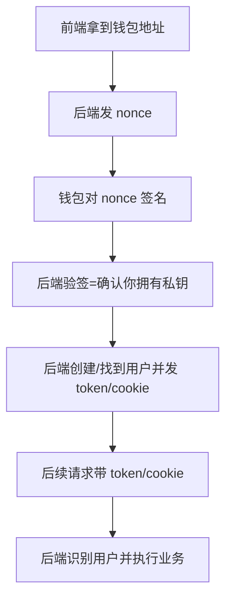

# 认证流程（MVP）

> 目标：让后端“确认你确实拥有某个钱包地址”，避免仅靠请求头伪造身份。

## 为什么需要
- 仅传 `X-Wallet-Address` 没有任何证明能力，任何人都能伪造。
- 通过“nonce + 签名”可以证明“你拥有该地址私钥”。

## 端到端流程（简化版）
1) 前端获取一次性口令 nonce  
2) 钱包对包含 nonce 的消息签名  
3) 前端提交 message + signature  
4) 后端验签成功后签发登录态（token/cookie）  
5) 后续请求只带 token/cookie，不再信任地址请求头



## 后端验签原理（通俗）
- 钱包签名只能用私钥生成；
- 后端可以用签名“还原出地址”，只要还原出的地址与你声称的地址一致，就证明你拥有私钥。

## 前端签名示例（viem）

```ts
import { createWalletClient, custom } from 'viem'
import { mainnet } from 'viem/chains'

const walletClient = createWalletClient({
  chain: mainnet,
  transport: custom(window.ethereum),
})

export async function signNonce(
  address: `0x${string}`,
  message: string,
) {
  const signature = await walletClient.signMessage({
    account: address,
    message,
  })
  return signature
}
```

## 接口约定（当前实现）
- `GET /auth/nonce?address=0x...`
  - 返回：`{ address, nonce, message, expiresAt }`
  - 前端拿 `message` 做签名
- `POST /auth/verify`
  - 入参：`{ message, signature }`
  - 返回：`{ token }`
- 后续业务请求：
  - Header：`Authorization: Bearer <token>`

## Message 格式（后端生成）
```
Agent Market Web3 Login
Address: 0xabc...
Nonce: f3a1c2...
```

## 后端需要保证的安全点
- nonce 必须存储、绑定地址、一次性使用、带过期时间（防重放）。
- 固定消息模板 + nonce 防重放。
- 登录态使用 JWT 或 HttpOnly Cookie；生产环境禁用开发口子（如发币接口）。

## 环境变量（后端）
- `JWT_SECRET`：JWT 签发密钥（生产必须设置）
- `JWT_EXPIRES_IN`：JWT 过期时间（默认 `7d`）
- `NONCE_TTL_SECONDS`：nonce 过期秒数（默认 `300`）
