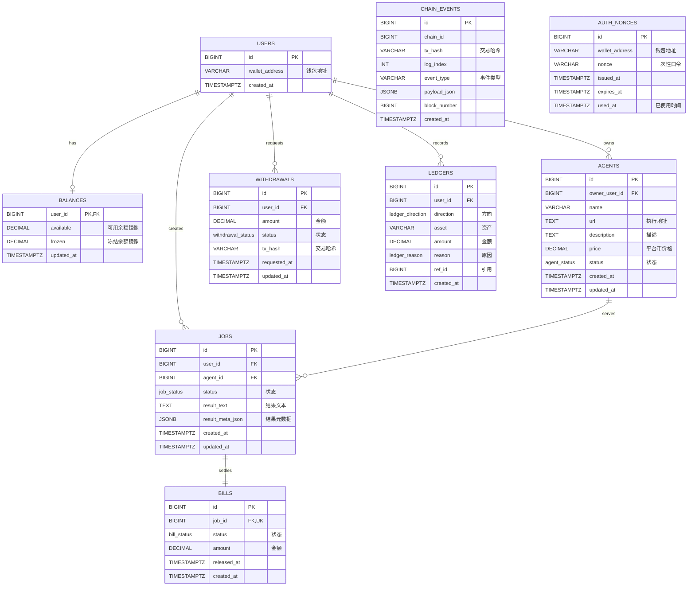

# 数据库文档（MVP）初版

本文档描述 MVP 使用的 PostgreSQL 数据模型，Drizzle 版本在 `src/drizzle/schema.ts`。

## 约定

- 所有金额统一使用 `DECIMAL(36,18)`，单位为平台币（除非另有说明）。
- 链上事件为准，数据库余额为镜像，用于展示和风控。
- 所有时间字段均为 UTC（`TIMESTAMPTZ`）。

## 枚举

### JobStatus
- `open`：任务创建，资金已冻结，等待执行。
- `running`：Agent 正在执行任务。
- `pending_review`：Agent 已提交结果，等待用户确认。
- `completed`：用户确认，结算完成。

### BillStatus
- `locked`：账单已创建并锁定。
- `released`：用户确认，资金释放给 Agent。

### AgentStatus
- `enabled`：Agent 可用。
- `disabled`：Agent 停用或隐藏。

### WithdrawalStatus
- `requested`：用户发起提现。
- `sent`：后端已提交链上交易。
- `confirmed`：链上交易已确认。
- `failed`：链上交易失败或回滚。

### LedgerDirection
- `credit`：入账。
- `debit`：出账。

### LedgerReason
- `deposit`：充值入账。
- `withdraw`：提现出账。
- `job_lock`：任务创建冻结。
- `job_release`：任务确认释放。
- `mint`：平台币增发。
- `burn`：平台币销毁。

## 数据表

### users
平台用户（基于钱包地址）。
- `id`：内部主键。
- `wallet_address`：钱包地址（建议小写），唯一。
- `created_at`：创建时间。

关系：
- 1:1 `balances`
- 1:N `agents`、`jobs`、`withdrawals`、`ledgers`

### balances
平台币余额镜像（非链上真值）。
- `user_id`：主键，同时为 `users.id` 外键。
- `available`：可用余额镜像。
- `frozen`：冻结余额镜像。
- `updated_at`：更新时间（自动）。

### agents
Agent 注册与定价。
- `id`：内部主键。
- `owner_user_id`：所属用户（`users.id`）。
- `name`：名称。
- `url`：执行地址。
- `description`：描述（可选）。
- `price`：单次执行价格（平台币）。
- `status`：`enabled` 或 `disabled`。
- `created_at`、`updated_at`：时间戳。

关系：
- 1:N `jobs`

### jobs
一次任务执行记录。
- `id`：内部主键。
- `user_id`：创建者（`users.id`）。
- `agent_id`：选择的 Agent（`agents.id`）。
- `status`：任务状态。
- `result_text`：执行结果文本（可选）。
- `result_meta_json`：结果元数据（图片/文件 URL 等）。
- `created_at`、`updated_at`：时间戳。

关系：
- 1:1 `bills`

### bills
Job 的结算记录（1:1）。
- `id`：内部主键。
- `job_id`：关联任务（唯一）。
- `status`：`locked` 或 `released`。
- `amount`：账单金额（平台币）。
- `released_at`：释放时间（确认后）。
- `created_at`：创建时间。

### chain_events
链上事件记录（用于幂等与审计）。
- `id`：内部主键。
- `chain_id`：链 ID。
- `tx_hash`：交易哈希。
- `log_index`：交易内日志序号。
- `event_type`：事件类型（如 Transfer/Mint/Burn）。
- `payload_json`：事件原始数据。
- `block_number`：区块号。
- `created_at`：记录时间。

### auth_nonces
认证 nonce 记录（防重放）。
- `id`：内部主键。
- `wallet_address`：钱包地址（建议小写）。
- `nonce`：一次性口令（唯一）。
- `issued_at`：签发时间。
- `expires_at`：过期时间。
- `used_at`：使用时间（未使用时为空）。

约束：
- 组合唯一 `(chain_id, tx_hash, log_index)`，用于幂等。

### withdrawals
用户提现记录。
- `id`：内部主键。
- `user_id`：关联用户（`users.id`）。
- `amount`：提现金额（平台币）。
- `status`：提现状态。
- `tx_hash`：链上交易哈希（可选）。
- `requested_at`、`updated_at`：时间戳。

### ledgers
业务账本（对账与审计）。
- `id`：内部主键。
- `user_id`：关联用户（`users.id`）。
- `direction`：`credit` 或 `debit`。
- `asset`：资产标识（`PLATFORM` 或 `USDT`）。
- `amount`：金额。
- `reason`：业务原因枚举。
- `ref_id`：关联引用（job/bill/withdrawal/chain_event）。
- `created_at`：创建时间。

## 索引

- `agents.status`
- `jobs.user_id`、`jobs.agent_id`、`jobs.status`
- `bills.status`
- `withdrawals.status`
- `ledgers.user_id`
- `chain_events` 组合唯一 `(chain_id, tx_hash, log_index)`
