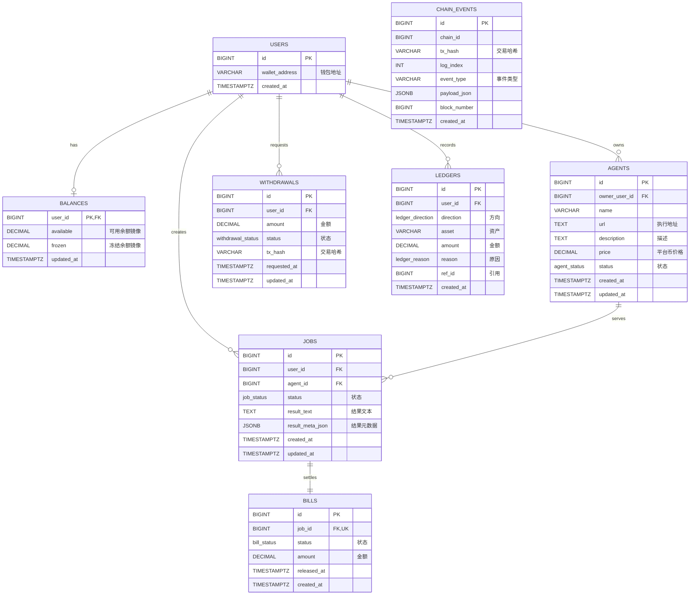

```mermaid
erDiagram
  USERS ||--o| BALANCES : has
  USERS ||--o{ AGENTS : owns
  USERS ||--o{ JOBS : creates
  USERS ||--o{ WITHDRAWALS : requests
  USERS ||--o{ LEDGERS : records

  AGENTS ||--o{ JOBS : serves

  JOBS ||--|| BILLS : settles

  USERS {
    BIGINT id PK
    VARCHAR wallet_address "钱包地址"
    TIMESTAMPTZ created_at
  }

  BALANCES {
    BIGINT user_id PK, FK
    DECIMAL available "可用余额镜像"
    DECIMAL frozen "冻结余额镜像"
    TIMESTAMPTZ updated_at
  }

  AGENTS {
    BIGINT id PK
    BIGINT owner_user_id FK
    VARCHAR name
    TEXT url "执行地址"
    TEXT description "描述"
    DECIMAL price "平台币价格"
    agent_status status "状态"
    TIMESTAMPTZ created_at
    TIMESTAMPTZ updated_at
  }

  JOBS {
    BIGINT id PK
    BIGINT user_id FK
    BIGINT agent_id FK
    job_status status "状态"
    TEXT result_text "结果文本"
    JSONB result_meta_json "结果元数据"
    TIMESTAMPTZ created_at
    TIMESTAMPTZ updated_at
  }

  BILLS {
    BIGINT id PK
    BIGINT job_id FK, UK
    bill_status status "状态"
    DECIMAL amount "金额"
    TIMESTAMPTZ released_at
    TIMESTAMPTZ created_at
  }

  WITHDRAWALS {
    BIGINT id PK
    BIGINT user_id FK
    DECIMAL amount "金额"
    withdrawal_status status "状态"
    VARCHAR tx_hash "交易哈希"
    TIMESTAMPTZ requested_at
    TIMESTAMPTZ updated_at
  }

  LEDGERS {
    BIGINT id PK
    BIGINT user_id FK
    ledger_direction direction "方向"
    VARCHAR asset "资产"
    DECIMAL amount "金额"
    ledger_reason reason "原因"
    BIGINT ref_id "引用"
    TIMESTAMPTZ created_at
  }

  CHAIN_EVENTS {
    BIGINT id PK
    BIGINT chain_id
    VARCHAR tx_hash "交易哈希"
    INT log_index
    VARCHAR event_type "事件类型"
    JSONB payload_json
    BIGINT block_number
    TIMESTAMPTZ created_at
  }
```
