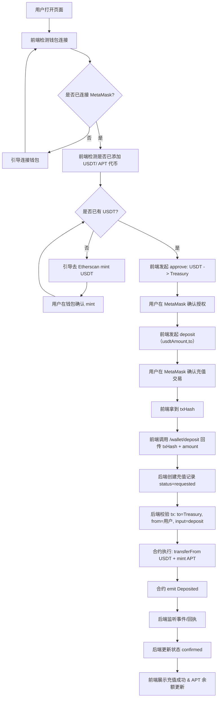
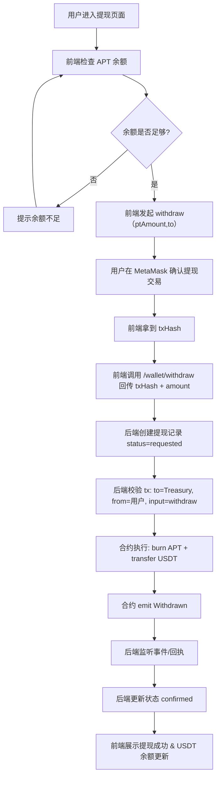
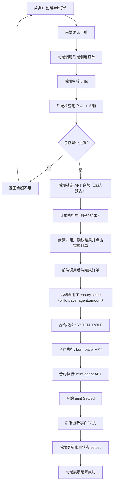

# 钱包授权/充值/提现/结算全流程

## 流程图（超详细新手版）

### 充值（USDT -> APT）


### 提现（APT -> USDT）


### 结算（订单内转移 APT）


---

## 0. 名词速查

- 钱包：用户的 MetaMask。
- 代币：
  - MockUSDT：测试用稳定币（用户先拿到它）。
  - APT：平台币（PlatformToken），用户充值后得到它，用于支付/结算。
- txHash：交易哈希，链上交易的唯一标识（类似快递单号）。
- 合约：
  - MockUSDT：测试 USDT ERC20。
  - PlatformToken：平台币 APT ERC20。
  - PlatformTreasury：平台金库/结算中枢。
- 角色权限：
  - TREASURY_ROLE：已授予 Treasury 合约。
  - SYSTEM_ROLE：后端服务持有，用于结算。
  - PAUSER_ROLE：安全团队持有，用于紧急暂停。

---

## 1. 关键原则（先看）

1) **ERC20 先授权再扣款**  
任何合约要从用户钱包转走 ERC20，都必须先 `approve`。  

2) **前端负责“发起链上交易”**  
用户签名必须在钱包里完成，前端负责引导签名并发起交易。  

3) **后端负责“记账+状态同步”**  
后端不应代替用户签名，但可以发起系统角色结算交易、监听链上事件、更新数据库状态。  

4) **合约是最终事实来源**  
后端记录是镜像，链上交易成功与否以合约事件为准。  

---

## 2. 合约与地址（Sepolia）

- MockUSDT: `0xbac7d7AAE206282201E83b31005fF2651565fc2C`
- PlatformToken (APT): `0xdea48b60cc5bCC6170d6CD81964dE443a8015456`
- PlatformTreasury: `0x44b5dd766B90156A08e449CD3049B2267A7bDD65`

ABI / types 在：
- `artifacts/contracts/*/*.json`
- `typechain-types/contracts/*`

---

## 3. 环境准备（用户侧）

### 3.1 领取测试 USDT
前端引导用户去 Etherscan 合约页面调用 mint：
1) 打开 MockUSDT 合约写入页  
2) 调用 mint/mintUSDT 给自己地址铸币  
3) 在 MetaMask 添加 MockUSDT 代币地址  

结果：用户钱包里有 USDT。

### 3.2 添加 APT 代币
前端提示用户在 MetaMask 添加 APT 地址。  
结果：充值后 APT 能显示在钱包中。  

---

## 4. 充值流程（USDT -> APT）

### 4.1 链路图（最简）
用户钱包 -> approve(USDT, Treasury) -> Treasury.deposit -> 铸 APT -> 钱包显示 APT

### 4.2 前端做什么
1) 引导用户授权 USDT  
   - 调用 MockUSDT `approve(spender=Treasury, amount)`  
   - 用户在 MetaMask 点确认  
2) 调用后端充值接口  
   - `POST /wallet/deposit`  
   - 传入 amount（to 由业务端固定为当前用户地址）  
3) 展示充值进度  
   - 交易 pending / confirmed  

### 4.3 后端做什么（更细）
1) 参数校验  
   - amount > 0  
   - address 格式正确  
   - 用户登录态有效  
2) 生成充值记录（先写 DB）  
   - status = requested  
   - 保存 amount、address、type=deposit  
3) 校验链上交易来源（推荐做）  
   - 前端把 txHash 回传  
   - 后端用 RPC 获取交易详情  
   - 校验 to 地址是否为 Treasury  
   - 校验 input 是否对应 `deposit(usdtAmount,to)`  
   - 校验 from 地址是否为当前用户  
4) 监听链上事件  
   - 订阅 Treasury 的 Deposited 事件（或交易回执）  
   - 找到 txHash 对应的事件  
   - 更新状态为 confirmed / failed  
5) 兜底轮询  
   - 如果事件监听断线，用轮询回执兜底  
   - 超时则标记为 pending 并提示用户稍后刷新  

### 4.4 合约做什么
1) MockUSDT：`transferFrom(user -> Treasury, amount)`  
2) PlatformToken：给用户 mint APT  
3) Treasury：作为中枢记录事件、触发日志  

---

## 5. 提现流程（APT -> USDT 或链下打款）

### 5.1 链路图（常见）
用户钱包 -> Treasury.withdraw -> burn APT -> 转 USDT -> 钱包收到 USDT

### 5.2 前端做什么
1) 提现申请  
   - `POST /wallet/withdraw`  
   - 传入 amount（to 由业务端固定为当前用户地址）  
2) 展示提现状态  
   - pending / confirmed  

### 5.3 后端做什么
1) 校验可用余额  
2) 发起链上提现交易（或引导前端发起）  
3) 写入提现记录（`type=withdraw`）  
4) 监听链上事件更新状态  

### 5.4 合约做什么
1) PlatformToken：销毁/扣除 APT  
2) MockUSDT：向用户转出 USDT（若链上兑付）  
3) Treasury：处理提现并发事件  

---

## 6. 结算流程（订单结算）

### 6.1 什么时候会发生
用户在平台上消费（调用 Agent），需要把 APT 从用户转到 Agent。

### 6.2 前端做什么
1) 发起订单/支付  
2) 展示“结算中/已完成”  

### 6.3 后端做什么（必须 SYSTEM_ROLE）
1) 生成 `billId`（如订单号哈希）  
2) 调用 Treasury `settle(billId, payer, agent, amount)`  
3) 更新账单状态，避免重复结算  

### 6.4 合约做什么
1) 从 payer 销毁 APT  
2) 给 agent 铸造等额 APT  
3) 标记账单已结算，触发 Settled 事件  

---

## 7. 失败与排错清单

### 7.1 授权失败
症状：充值时提示 allowance 不足  
原因：未 approve 或 approve 数量太小  
处理：前端重新引导 approve  

### 7.2 余额不足
症状：withdraw/settle 失败  
处理：检查 APT 余额、冻结余额与订单金额  

### 7.3 交易 pending 太久
症状：前端一直转圈  
处理：后端监听交易哈希并提供 tx 状态查询  

### 7.4 角色权限报错
症状：settle 报 AccessControl  
处理：确认后端钱包具备 SYSTEM_ROLE  

---

## 8. 接口与链上动作对齐（简表）

### 充值
- 前端：approve + POST `/wallet/deposit`
- 后端：记录 + 交易/监听
- 合约：USDT transferFrom -> mint APT

### 提现
- 前端：POST `/wallet/withdraw`
- 后端：记录 + 交易/监听
- 合约：burn APT -> 转 USDT

### 结算
- 前端：订单请求
- 后端：`settle`（SYSTEM_ROLE）
- 合约：burn payer APT -> mint agent APT

---

## 11. 标准交易流程（含后端）

以下是较规范、可落地的“钱包交易”流程，兼顾安全与可追溯性。

### 11.1 充值（USDT -> APT）
1) 前端  
   - 触发 `approve`（用户签名）  
   - 发起 `deposit(usdtAmount,to)`（用户签名）  
   - 拿到 `txHash` 回传后端  
2) 后端  
   - 生成充值单（status=requested）  
   - 校验 txHash：to=Treasury、from=用户、input=deposit  
   - 监听 Deposited 事件或交易回执  
   - 确认后更新状态为 confirmed  
3) 合约  
   - transferFrom USDT  
   - mint APT  
   - emit Deposited  

### 11.2 提现（APT -> USDT）
1) 前端  
   - 发起 `withdraw(ptAmount,to)`（用户签名）  
   - 拿到 `txHash` 回传后端  
2) 后端  
   - 生成提现单（status=requested）  
   - 校验 txHash：to=Treasury、from=用户、input=withdraw  
   - 监听 Withdrawn 事件或交易回执  
   - 确认后更新状态为 confirmed  
3) 合约  
   - burn APT  
   - transfer USDT  
   - emit Withdrawn  

### 11.3 结算（订单内转移 APT）
1) 前端  
   - 提交订单 / 触发结算请求  
2) 后端（SYSTEM_ROLE）  
   - 生成 billId  
   - 调用 `settle(billId, payer, agent, amount)`  
   - 监听 Settled 事件  
   - 更新账单状态  
3) 合约  
   - burn payer APT  
   - mint agent APT  
   - emit Settled  

---

## 9. 最小示例（伪代码）

### 前端：授权 + 充值
```ts
// 1) approve USDT
await usdt.approve(treasuryAddress, amount);

// 2) 调用后端充值接口
await fetch('/wallet/deposit', {
  method: 'POST',
  body: JSON.stringify({ amount, address }),
});
```

### 后端：结算
```ts
const billId = ethers.keccak256(ethers.toUtf8Bytes(orderId));
await treasury.settle(billId, payer, agent, amount);
```

---
